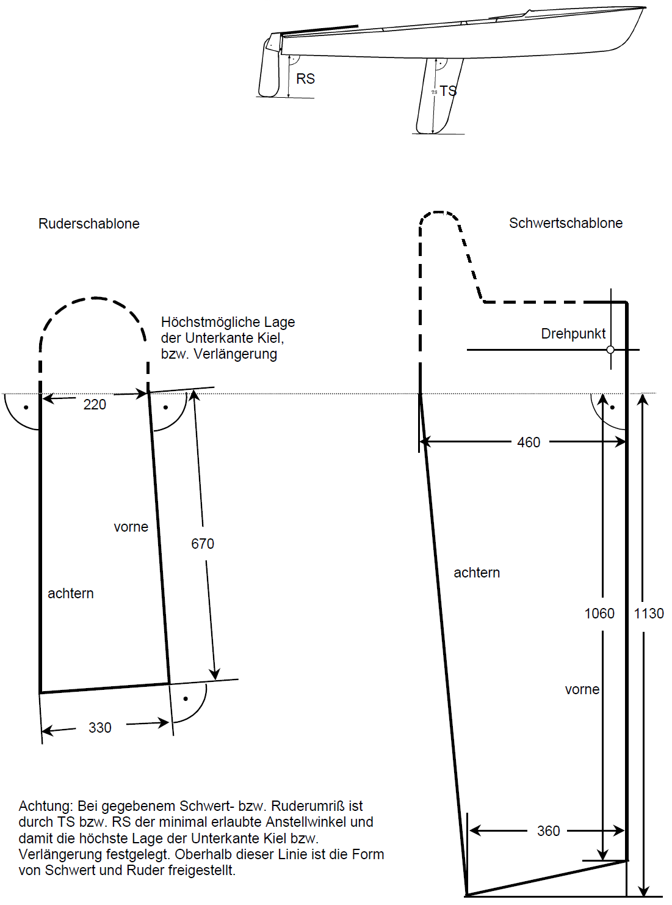

# Klassenvorschrift der nationalen Jeton-Klasse
{: .fs-9 }

Diese Klassenvorschrift wurde am 3. Mai 1997 durch die ordentliche Mitgliederversammlung der Klassenvereinigung der Jeton-Klasse ASJETON verabschiedet und am 25. Februar 1998 durch den Technischen Ausschuß des DSV genehmigt.
{: .fs-3}

**Ergänzungen**:  
In den Regeln 6.2, 16.9, 16.10.2, 18 Genehmigung DSV vom 29.11.2002, in Kraft ab 01.04.2003   
{: .fs-3}

---

## 1 Allgemeines

- **1.1** Die Jeton-Jolle ist eine von U. Mares und H. Raudaschl im Auftrag der Klepper-Werke, Rosenheim, entworfene 2-Mann-Einheitsjolle.

- **1.2** Diese Klassenvorschrift soll sicherstellen, daß alle Boote dieser Klasse in allen Punkten, die die Geschwindigkeit und die Segeleigenschaften beeinflussen, soweit wie möglich gleich sind. Alles was in dieser Klassenvorschrift nicht erlaubt ist, ist verboten. Die Klassenvorschrift ist in diesem Sinne auszulegen.

- **1.3** Um unerwünschte Konstruktionen oder Abweichungen von den Plänen und/oder der Klassenvorschrift zu verhindern, die nicht im Sinne der Klasse sind und das Prinzip der Einheitsklasse gefährden, können Änderungen in den Plänen oder der Klassenvorschrift kurzfristig vom Technischen Ausschuß des DSV vorgenommen werden.

- **1.4** Um technische Verbesserungen zu erproben, die über diese Vorschrift hinausgehen, kann der Technische Ausschuß des DSV auf Antrag der Klassenvereinigung einzelnen Booten (höchstens drei) Ausnahmegenehmigungen für die Teilnahme an Regatten erteilen. Diese Boote sind nicht berechtigt zur Teilnahme an Meisterschaften. Nach genügender Erprobung entscheidet der Technische Ausschuß des DSV, ob solche Änderungen in die Klassenvorschrift aufgenommen werden.

- **1.5** Alle Boote dieser Klasse müssen nach den offiziellen Unterlagen gebaut sein (Klassenvorschrift, Zeichnungen, Meßbrief). Bestehen Widersprüche zwischen Klassenvorschrift, Zeichnungen und Meßbrief, so ist dieses dem Technischen Ausschuß des DSV zur Klärung vorzulegen.

- **1.6** Die Verwaltung der Klasse obliegt dem DSV in Zusammenarbeit mit der Klassenvereinigung.

- **1.7** Der DSV und die Klassenvereinigung übernehmen keine rechtliche Haftung hinsichtlich dieser Klassenvorschrift und irgendwelcher daraus abgeleiteter Ansprüche.

## 2 Gebühren und Baulizenzen

- **2.1** Die Vermessungs- und Registriergebühren werden vom nationalen Verband festgelegt und richten sich nach den jeweils gültigen Gebührenordnungen.

- **2.2** Der Lizenzgeber ist die Firma Bootsbau Gruben. Über Vergabe von Baulizenzen entscheiden:
  - • DSV (1 Stimme)
  - • Jeton-Klassenvereinigung (1 Stimme)
  - • Bootsbau Gruben (1 Stimme)

- **2.3** Kommt keine Einigung zustande, wird der Status "Nationale Klasse" aberkannt.

- **2.4** Die Lizenzgebühren sind im Kaufpreis inbegriffen.

## 3 Hersteller

- **3.1** Boote der Jeton-Klasse dürfen nur von Herstellern gefertigt werden, die vom DSV lizensiert sind.

- **3.2** Durch seine Unterschrift auf dem Meßbrief- bzw. IBS-Antrag erklärt der Hersteller, das Boot in Übereinstimmung mit den offiziellen Unterlagen gebaut zu haben.

- **3.3** Der Hersteller ist verpflichtet, unter Verzicht auf die Einrede der Verjährung alle nachweislich beim Bau durch sein Verschulden entstandenen Regelwidrigkeiten auf eigene Kosten zu beseitigen und die Kosten für die Nachvermessung der betroffenen Boote zu tragen.

## 4 Registrierung, Messbrief

- **4.1** An Klassenwettfahrten dürfen nur solche Boote teilnehmen, für die ein gültiger, vom DSV auf den Namen des Eigners ausgestellter Meßbrief vorliegt.

- **4.2** Der Meßbrief kann von der DSV-Geschäftsstelle ausgegeben werden, nachdem vom Eigner der Antrag auf Ausstellung eines Internationalen Bootsscheines (IBS) gestellt wurde.

- **4.3** Mit dem Meßbrief erhält der Eigner eine DSV-Vermessungsplakette, die deutlich sichtbar am Spiegel (außen) des Bootes anzubringen ist. Diese Plakette kennzeichnet das Boot als ordnungsgemäß vermessen.

- **4.4** Der Meßbrief wird ungültig durch

    - **a)** Eignerwechsel: In diesem Fall muß der Meßbrief beim DSV eingereicht werden, zusammen mit einer Erklärung des Voreigners, daß am Boot keine Veränderungen vorgenommen wurden, die gegen die Klassenvorschrift verstoßen.
    - **b)** Änderungen an Rumpf, Rigg oder Segel: Hierzu ist eine Nachvermessung durch einen DSV-Vermesser notwendig.

- **4.5** Regel 4 kann ersetzt werden durch entsprechende Vorschriften anderer nationaler Verbände.

## Vermessung

- **5.1** Die Typenprüfung und/oder Vermessung darf nur durch einen anerkannten DSV-Vermesser vorgenommen werden.

- **5.2** Kein Vermesser darf ein Boot, Spieren, Segel oder Ausrüstung vermessen, die ihm gehören, die von ihm hergestellt wurden bzw. an denen er beteiligt oder Miteigentümer ist (Ausnahme: C-Vermesser).

- **5.3** Zur Vermessung sind nur die offiziellen Jeton-Schablonen zugelassen.

- **5.4** Soweit die Klassenvorschrift nichts anderes aussagt, gelten die Vermessungsvorschriften der IYRU.

- **5.5** Nach der Erstvermessung (Typenprüfung) ist der Eigner verantwortlich für die Einhaltung der Klassenvorschrift.

- **5.6** Die Vermessung der Jeton-Klasse kann in Form einer Typenprüfung durchgeführt werden. Die Bedingungen einer Typenprüfung werden im einzelnen zwischen DSV und Bauwerft geregelt. Die Überprüfung selbst erfolgt nach folgendem Schema:

    - **5.6.1** Die ersten Boote einer Serie (mindestens 3) werden von einem DSV-Vermesser entsprechend dieser Klassenvorschrift geprüft.

    - **5.6.2** Vom DSV werden die Meßblätter der Typenprüfung kontrolliert, und bei ausreichender Baugenauigkeit wird die Typenprüfung genehmigt.

    - **5.6.3** DSV kontrolliert weiterhin unregelmäßig die Fertigung der Werft. Die Klassenvereinigung hat das Recht, eine derartige Prüfung beim DSV zu beantragen.

    - **5.6.4** Werden die Formen erneuert bzw. geändert, muß ein DSV-Vermesser für diese Serie erneut die nach 5.6.1 geforderten Vermessungen durchführen.

    - **5.6.5** Boote einer Typenprüfungsserie erhalten einen Meßbrief mit dem Vermerk "Typgeprüft". Eine Einzeleintragung aller Maße entfällt. Ausgefüllt werden muß jedoch das Gewicht und Teile, die nicht von der Werft entsprechend dem Standard der Typenprüfung geliefert werden und somit einer Einzelvermessung unterliegen.

## 6 Identifizierungszeichen

- **6.1** Die im Meßbrief angegebene Nummer des Rumpfes ist am Rumpf - Innenseite Spiegel, durch den Schaudeckel sichtbar - einzulaminieren.

- **6.2** Im Großsegel muß sich oberhalb der halben Höhe die Segelnummer befinden. Das Klassenzeichen ist im Großsegel über der Segelnummer anzubringen. Im Großsegel ist zusätzlich das Nationalitätszeichen vor oder über der Segelnummer zu führen. Als Nationalitätskennzeichen müssen entweder die vor dem 31. März 1999 vorgeschriebenen oder die danach in WR 77 vorgeschriebenen Nationalitätsbuchstaben gefahren werden.

- **6.3** Die Segelnummer steht unter dem Klassenzeichen und muß *300±20 mm*  
    hoch sein, die Schriftstärke beträgt mindestens *50 mm*  
    Klassenzeichen und Segelnummer müssen in roter Farbe ausgeführt sein und sind auf beiden Seiten des Großsegels in unterschiedlicher Höhe anzubringen, an Steuerbord höher als an Backbord. Das Segelzeichen des Jeton besteht aus einem in der Mitte zweigeteilten Kreis; die obere Hälfte ist rot, die untere Hälfte enthält ein rotes "J". 
    Der Durchmesser des Segelzeichens beträgt *320±20 mm*  
    (gemäß Segelblatt).

- **6.4** Auf dem Spinnaker sind Nationalitätszeichen und Unterscheidungsnummer (Größe unter 6.3) in ähnlicher Weise jedoch in annähernd halber Höhe in kontrastierender Farbe anzubringen.

## 7 Bauverfahren

- **7.1** Der Jeton-Rumpf darf nur im Handauflegeverfahren in GFK hergestellt werden. Das Deck darf in Holz gefertigt werden.

    - **7.1.1** Sandwichbauweise ist erlaubt. Sandwichbauweise darf auch zur Verstärkung von einzelnen Flächen eingesetzt werden.

    - **7.1.2** Schotten, Reitbalken sowie Versteifungen jeglicher Art sind freigestellt.

    - **7.1.3** Als Materialien sind ausschließlich zugelassen: Glasfaser, Polyester, Hartschaum, Holz.

- **7.2** Das Boot darf in Doppelschalenbauweise gebaut werden. Die Bauweise der Doppelschale muß so stabil ausgeführt werden, daß sie für die Mannschaft allseitig begehbar ist. Das Deck darf aus mehreren Baugruppen bestehen.

    - **7.2.1** Die Wandstärke des Rumpfes einerseits und des Decks andererseits ist gleichmäßig auszuführen. Sie darf nicht mehr als 1 mm variieren. Davon ausgenommen sind die Überlappungsbereiche von nicht mehr als 100 mm am Kiel, zwischen den Flächen des Decks sowie die Flansche der Verstärkungen.

    - **7.2.2** Es darf kein Versuch unternommen werden, etwa durch verschiedene Rumpf- oder Decksstärken, durch Verwendung verschiedener Materialien oder Bauverfahren, verschiedenstarker Glasmatten oder Sättigungsgrade, Gewicht in der Mitte des Rumpfes zu konzentrieren. Bei Verdacht, daß diese Regel gebrochen wurde, können auf Anweisung des Vermessers Probelöcher in ausreichender Zahl (aber nicht mehr als 8) über die Schiffslänge verteilt, gebohrt werden, um die Einhaltung dieser Regel zu überprüfen.

- **7.3** 
    - **A)** Im vorderen Plicht-Bereich muß ein Doppelboden vorhanden sein. Abstand Achterkante Doppelboden von Fläche ‚0‘
        *LDB max. 1700 mm*  
        *min. 1400 mm*
    - **B)** Wenn im achteren Plicht-Bereich eine Innenschale vorhanden ist, darf der Abstand zwischen Oberseite Schale und Außenseite Rumpf *max. 30 mm*  
        betragen.
    - **C)** Alle geschlossenen Abteilungen und das Vor- und Achterschiff müssen durch jeweils eine Inspektionsluke zugänglich sein. Zusätzliche Inspektionsluken sind freigestellt. Alle Inspektionsluken müssen während der Wettfahrt wasserdicht verschlossen sein.

## 8 Rumpfvermessung

- **8.1** Allgemeines

    - **8.1.1** Vor Beginn der Vermessung muß die waagerechte Lage des Bootes in Längs- und Querschiffsrichtung überprüft werden. Die in 8.1.3 definierte Bezugslinie bestimmt die waagerechte Lage des Bootes in Längsschiffsrichtung.

- **8.2** Vermessung des Rumpfes kieloben gemäß Meßblatt 1.

    - **8.2.1** Länge über Alles vom Steven ohne Scheuerleiste bis Abrißkante am Spiegel (Fläche "0") *LA 4915±15 mm*

    - **8.2.2** Bestimmung der Positionen der Vermessungsspanten 1 bis 3:

        - **(i)** Abstand von Fläche "0" bis Vermessungsspant 1 auf Kiellinie *SP1 1235 mm*  
            von Spiegelkante entlang unter Scheuerleiste *SP1 1225 mm*

        - **(ii)** Abstand von Fläche "0" bis Vermessungsspant 2 auf Kiellinie *SP2 2635 mm*  
            von Spiegelkante entlang unter Scheuerleiste *SP2 2625 mm*

        - **(iii)** Abstand von Fläche "0" bis Vermessungsspant 3 auf Kiellinie *SP3 4035 mm*  
            von Spiegelkante entlang unter Scheuerleiste *SP3 4073 mm*

    - **8.2.3** Vermessung des Kielsprunges, gemessen von Basis bis Unterkante Kiel:
        - H0 = (Basismaß) *200 ± 0 mm*  
        - H1 = *118 ± 10 mm*  
        - H2 = *60 ± 10 mm*  
        - H3 = (Basismaß) *72 ± 0 mm*  
        - HST = *650 ± 10 mm*

    - **8.2.4** Spiegelneigung mit Hilfe der Schablonen gemäß Blatt 1: 
        *LSPo 48±5 mm*  
        *LSPu 37±4 mm*

    - **8.2.5** Spantvermessung von "0" bis 3 mit Vermessungsschablonen.  
        Maßtoleranz *± 10 mm*  
        für Spantprofil und Deckshöhe. Die Vermessungsschablonen sind lotrecht zur Basislinie anzulegen bis auf die Spiegelschablone, die an der Neigung des Spiegels anzulegen ist.

    - **8.2.6** Bugvermessung mit Schablone. Maßtoleranz für Stevenkontur *± 5 mm*  
        Schablone wird am Steven angelegt.

    - **8.2.7** Die Rumpfaußenhaut muß gleichmäßig strakend sein. Hohle Stellen mit mehr als *2 mm*  
        Tiefe in der Oberfläche des Kieles oder des Bootskörpers sind verboten. Die Überprüfung dieser Vorschrift ist mit einer mind. *1000 mm*  
        langen Straklatte durchzuführen.

    - **8.2.8** Lage des Schwertdrehpunktes: waagerechter Abstand von Spant 2 *LSB 190±10 mm*

    - **8.2.9** Schwertkasten
        - **(i)** Lichte Weite des Schwertkastens am Kiel, ausgenommen Führungshilfen *BSK 30±5 mm* 
        - **(ii)** Vorderkante Schwertkasten bis Fläche "0" *LSV 2535±15 mm*
        - **(iii)** Hinterkante Schwertkasten bis Fläche "0" *LSA 1275±15 mm*

- **8.3** Vermessung des Rumpfes in Normallage:

    - **8.3.1** Eindeckung Vorschiff vom Steven aus 
        *LDV min 1525 mm*  
        *LDV max 2140 mm*

    - **8.3.2** Eindeckung Achterschiff von Fläche "0" aus *LDA 145±10 mm*  

    - **8.3.3** Eindeckung Seitentanks
        - **(i)** bei Spant 2 *BD2 270±20 mm*
        - **(ii)** bei Spant 1 *BD1 250±20 mm*
        - **(iii)** am Spiegel *BDS 210±20 mm*

    - **8.3.4** Größte Breite, ohne Scheuerleiste *B 1740±10 mm*

    - **8.3.5** Scheuerleiste
        - **(i)** Größte Breite der Scheuerleiste horizontal *max. 45 mm*
        - **(ii)** Größte Höhe der Scheuerleiste vertikal *max. 55 mm*

    - **8.3.6** Kleinster Abstand Mastvorderkante bis Fläche "0" *LM min. 2980 mm*

    - **8.3.7** Abstand des Schnittpunktes des Fockvorlieks auf Deck von Fläche "0" *LVS max. 4520 mm*

    - **8.3.8** Abstand Verbindungslinie der Angriffspunkte der Wanten von Fläche "0" *LW 2635±5 mm*  
        Abstand der Angriffspunkte der Wanten voneinander querschiffs an Deck *BW 1683±5 mm*

- **8.4** Auftrieb

    - **8.4.1** Das segelfertige Boot muß in vollgelaufenem Zustand ein Auftriebsvolumen von *min. 150 l*  
        haben. Der Auftrieb wird durch geeignete geschlossenzellige Schaumstoffkörper erzeugt.

    - **8.4.2** Das Boot muß in vollgelaufenem Zustand annähernd waagerecht schwimmen; dies wird durch die gleichmäßige Anordnung der Auftriebselemente in den Seitentanks erreicht.

    - **8.4.3** Dem Vermesser bleibt es vorbehalten, den Auftrieb durch einen Tauchtest festzustellen. Nach 1/2-stündigem Untertauchen dürfen die Tanks maximal 5%´ihres Auftriebs verloren haben.

- **8.5** Im Spiegel sind bis zu 2 Lenzschächte mit einer lichten Fläche von je *max. 5500 mm²*  
    erlaubt.

- **8.6** Eine Spinnakertrompete ist erlaubt. Sie muß entweder direkt nach Außenbord oder in die Plicht lenzen.

## 9 Schwert

- **9.1** Das Schwertmaterial ist freigestellt.

- **9.2** Das Schwert darf profiliert sein.

- **9.3** Das Schwert muß voll in den Schwertkasten aufholbar sein.

- **9.4** Die Dicke des Schwertes beträgt *min. 20 mm,*  
*max. 28 mm*

- **9.5** Das Gewicht des Schwertes inklusive Haltebeschläge muß
    *min. 4,0 kg,*  
    *max. 8,0 kg*  
    betragen.

- **9.6** Maximale Formabweichung gegenüber Schablone nach Meßblatt 2 *+ 0 mm*  
    *beliebig kleiner*

- **9.7** Größte wirksame Länge des Schwertes in voll ausgefahrenem Zustand von Rumpfunterkante senkrecht gemessen *TS max. 1060 mm*

## 10 Ruder

- **10.1** Das Material des Blattes ist freigestellt.

- **10.2** Das Blatt darf profiliert sein.

- **10.3** Die Ruderanlage muß gegen Herausfallen gesichert sein.

- **10.4** Das Ruder darf feststehend oder aufholbar sein. Länge und Form der Pinne mit Ausleger sind freigestellt; Auf- und Niederholer dürfen gefahren werden.

- **10.5** Die Dicke des Ruder beträgt *max. 30 mm*

- **10.6** Mindestgewicht der Ruderanlage einschließlich Blatt, Kopf, Pinne und Ausleger *4 kg*

- **10.7** Maximale Formabweichung gegenüber Schablone nach Meßblatt 2 *+ 0*  
    *beliebig kleiner*

- **10.8** Maximale Länge in gefiertem Zustand unterhalb der verlängerten Kiellinie bei Fläche "0" *TR max. 700 mm*

## 11 Gewichte

- **11.1** Mindestgewicht des nackten Bootsrumpfes einschließlich aller fest angebrachten Beschläge, ohne Schwert 
    *min. 115 kg*

- **11.2** Zur Erreichung des Mindestgewichtes sind Ausgleichsgewichte von *GA max. 5 kg*  
    erlaubt. Sie müssen am schrägen Querschott vor dem Mast *4/5 GA*  
    und am Innenspiegel *1/5 GA*  
    nicht mehr als *max. 150 mm*  
    unter Oberkante Deck montiert sein. Die Ausgleichsgewichte sind so zu befestigen, daß sie ohne Werkzeug nicht entfernt werden können. Sie dürfen innerhalb der Tanks montiert werden, jedoch müssen Schrauben von außen sichtbar sein.

- **11.3** Mindestgewicht des segelfertigen Bootes einschließlich Schwert, Ruderanlage, Mast mit stehendem und laufendem Gut, Großbaum, Auftriebskörpern, jedoch ohne Segel und sonstige Ausrüstung. *min. 142 kg*

## 12 Mast

- **12.1** Das Material des Mastes ist eine Aluminiumlegierung.

- **12.2** Der Mast darf nicht drehbar und permanent gebogen sein.

- **12.3** Der Vermessungsnullpunkt muß zwischen Decksoberkante und Schandeckshöhe (Schnittpunkt Seite Deck-Aussenhaut) gemessen im Abstand LM, liegen. Dieser Vermessungsnullpunkt ist am Mast in Gestalt eines kontrastierend gemalten Meßbandes fixiert  
    Meßmarke 0, Oberkante Meßband *M0 0 mm*

    - **12.3.1** Meßmarke 1 (tiefste Stelle Oberkante Baum): von Oberkante Vermessungsnullpunkt bis Oberkante Marke 1 *MI min. 485 mm*

    - **12.3.2** Meßmarke VS (Schnittpunkt Innenkante Verlängerung Fockvorliek - Vorderkante Mast): von Oberkante Vermessungsnullpunkt bis Unterkante Marke VS *MVS max. 5260 mm*

    - **12.3.3** Meßmarke 2 (höchste Stelle vom Großsegel-Kopf): von Oberkante Vermessungsnullpunkt bis Unterkante Marke 2 *MII max. 6960 mm*

    - **12.3.4** Maximaler Abstand des Spinnakerfallbeschlages (Umlenkrolle-Oberkante) bis Vermessungsnullpunkt *MSP max. 5430 mm*

    - **12.3.5** Maximaler Abstand des Spinnakerfallbeschlages von Vorderkante Mast *MSPV max. 60 mm*

- **12.4** Mastprofil

    - **12.4.1** Das Mastprofil muß zwischen den Meßmarken 1 und VS gleiche Querschnittsabmessungen haben. Eine Verjüngung oberhalb der Meßmarke VS ist erlaubt.

    - **12.4.2** Profilquerschnitt: 
        Breite (querschiffs) *min. 53 mm*  
        Länge (längsschiffs) *min. 62 mm*

- **12.5** Das Topgewicht des Mastes muß mindestens *min. 3,6 kg*  
    betragen.

    Zur Ermittlung des Topgewichts wird der Mast in waagerechter Lage an der Meßmarke 0 gelagert und das Gewicht an der Meßmarke 2 bestimmt. Die Verstagung ist zu entfernen, nicht jedoch die Saling. Die Fallen werden in die Position gebracht, wie sie sie bei gehißtem Segel einnehmen.

- **12.6** Als Trimmmöglichkeit am Mast ist ein Diamond und/oder eine Salinggarnitur erlaubt.

## 13 Großbaum

- **13.1** Das Material des Großbaumes ist eine Aluminiumlegierung.

- **13.2** Der Großbaum darf nicht permanent gebogen sein.

- **13.3** Meßmarke 3: Maximaler Abstand der Vorderkante Meßmarke bis Achterkante Mastprofil *MIII max. 2470 mm*

- **13.4** Großbaumprofil

    - **13.4.1** Das Großbaumprofil muß über seine gesamte Länge bis zur Meßmarke 3 gleiche Querschnittsabmessungen haben. Der Großbaum darf jedoch an der Unterseite vom Nock ausgehend abgeschrägt sein. Die Abschrägung darf nicht länger als *max. 300 mm*  
        von Meßmarke 3 aus nach vorne gemessen sein.

    - **13.4.2** Das Profil muß durch einen Kreis von *max. 80 mm*  
        passen.

    - **13.4.3** Mindestgewicht mit festmontierten Beschlägen *min. 2,5 kg*

## 14 Spinnakerbaum

- **14.1** Das Material des Spinnakerbaumes ist freigestellt.

- **14.2** Maximale Länge in eingehängtem Zustand incl. Haltebeschlag von Vorderkante Mitte Mast aus gemessen *SPL max. 2040 mm*

## 15 Stehendes/Laufendes Gut

- **15.1** Zur Verstagung des Mastes sind ein Paar Wanten, sowie ein Vorstag erlaubt.

- **15.2** Die Verstagung des Mastes (ausgenommen Vorstag) sowie Trapezdrähte müssen unterhalb der Marke VS angreifen.

- **15.3** Die Stärke von Wanten und Vorstag beträgt *min. 3 mm*

## 16 Beschläge

- **16.1** Das Boot muß mit minimal 2 Selbstlenzern ausgerüstet sein.

- **16.2** Maximal sind 2 Ablaßschrauben, lichter Durchmesser *30 mm*  
    im Aussenspiegel erlaubt.

- **16.3** Als Ausreithilfen sind lediglich im Cockpitboden montierte Ausreitgurte und je 1 Trapez für den Vorschoter an Backbord und Steuerbord erlaubt.

- **16.4** Die Großschotführung ist freigestellt.

- **16.5** Eine Vorrichtung zur seitlichen Führung des Mastes ist erlaubt. Sie darf *max. 150 mm*  
    über Schandeckshöhe angreifen.

    - **16.5.1** Ein Mastcontroller ist erlaubt. Er darf nicht höher als *max. 450 mm*  
        über Schandeckshöhe angreifen.

    - **16.5.2** Babywanten oder Unterwanten sind verboten.

- **16.6** Ein Fockwickler ist erlaubt.

- **16.7** Die Verwendung von Kompassen ist erlaubt.

- **16.8** Der Fockholepunkt ist freigestellt. Die Schoten dürfen nicht durch die Tanks laufen.

    - **16.8.1** Die Fockholepunkte dürfen fernverstellbar sein.

- **16.9** Die Führung der Spinnakerschoten ist freigestellt. Wenn sie durch Auftriebstanks laufen, müssen die Durchführungen so ausgeführt sein, dass die Wasserdichtigkeit der Tanks erhalten bleibt.

- **16.10** Trimmeinrichtungen

    - **16.10.1** Für Groß- und Vorsegel sind als Trimmeinrichtungen, die beim Segeln bewegt werden dürfen, erlaubt: Baumniederholer, Cunningham, Unterliekstrecker, Fockcunningham.

    - **16.10.2** Die Führung der Trimmschoten ist freigestellt. Wenn sie durch Auftriebstanks laufen, müssen die Durchführungen so ausgeführt sein, dass die Wasserdichtigkeit der Tanks erhalten bleibt.

- **16.11** Die Riggspannung darf durch Trimmen des Fockfalls eingestellt werden.

- **16.12** Ein verstellbarer Topnant ist erlaubt.

## 17 Segel

- **17.1** Vermessung

    - **17.1.1** Alle während einer Wettfahrt benutzten Segel müssen von einem DSV-Vermesser vermessen und gekennzeichnet sein.

    - **17.1.2** Für die Vermessung müssen die Segel trocken sein; das Segeltuch ist so straff zu spannen, daß Falten quer zur Vermessungsrichtung verschwinden.

- **17.2** Material

    - **17.2.1** Die Segel müssen aus gewebtem Material bestehen. Aramidfaser oder Kohlefaser sind verboten.

    - **17.2.2** Der Bereich und Dicke der Verstärkungen im Segel sind freigestellt.

- **17.3** Großsegel

    - **17.3.1** Das Großsegel darf nur innerhalb der Meßmarken 1, 2 und 3 gefahren werden. Die Oberkante des Großbaumes darf sich in rechtwinkliger Stellung zum Mast nicht unterhalb der Meßmarke 1 befinden.

    - **17.3.2** Sehne des Achterlieks *AL max. 6750 mm*

    - **17.3.3** Mittelbreiten

        - • Die Achterlieksrundung ist durch drei max. Breiten beschränkt.

        - • Die Breiten werden von den ¼-, ½-, ¾-Achterlieks-Vermessungspunkten zum jeweils nächsten Punkt am Vorliek einschließlich Vorliekstau gemessen.

        - • Die Achterlieks-Vermessungspunkte werden durch Übereinanderlegen von Kopf und Schothorn ermittelt, wobei die Hälften des Achterliecks, die dabei entstehen, gleichmäßig straff gezogen werden.

        - • Die ¼- und ¾-Punkte werden auf die gleiche Weise gefunden, indem der Kopf bzw. das Schothorn zum Mittelpunkt des Achterlieks gefaltet werden.

        - **(i)** Einviertelbreite *1/4W max. 1155 mm*

        - **(ii)** Einhalbbreite *1/2W max. 1850 mm*

        - **(iii)** Dreiviertelbreite *3/4W max. 2340 mm*

    - **17.3.4** Im Großsegel sind 5 Latten zu fahren, deren Material freigestellt ist. Länge der Lattentaschen (von Hinterkante Segel bis Innenkante Naht): Latte 1 (oberste Latte) *L1 max. 1030 mm*  
        Latte 2 bis 5 *max. 835 mm*
        Die Latten müssen mit Ausnahme der Latte 1 mit dem Achterliek abschließen. Die Latte 1 kann zu Trimmzwecken eingebunden werden.

    - **17.3.5** Breite des Kopfes senkrecht zur Achterkante am Mast gemessen *max. 150 mm*  
        Höhe des Kopfbrettes parallel zur Ackterkante Mast gemessen *max. 150 mm*

    - **17.3.6** Maximal 2 Fenster von insgesamt max. *0,25 m²*  
        sind erlaubt.

- **17.4** Fock

    - **17.4.1** Länge des Vorlieks *VL max. 4970 mm*  
        Sehne Achterliek *AL max. 4850 mm*  
        Sehne Unterliek *UL max. 2120 mm*  
        Kopfbreite *max. 40 mm*

    - **17.4.2** Die Rundung des Unterlieks, gemessen vom Kopf des Segels, bis zur Mitte des Unterlieks (durch Faltung ermittelt) darf *ML max. 5020 mm*  
        betragen. Die Rundung muß gleichmäßig sein.

    - **17.4.3** Ein Fenster von max. *0,2 m²*  
        ist erlaubt.

    - **17.4.4** Latten und Schothornbretter im Vorsegel sind nicht erlaubt.

- **17.5** Spinnaker

    - **17.5.1** Lieklänge *SL max. 4870 mm*

    - **17.5.2** Länge der Mittelfalte *ML max. 5470 mm*

    - **17.5.3** Unterlieklänge *UL max. 1730 mm*

    - **17.5.4** Mittelbreiten

        - **(i)** 1/4 Breite, 1218 mm vom Kopf gemessen *1/4W max. 1280 mm*

        - **(ii)** Mittelbreite, 2434 mm vom Kopf gemessen *1/2W max. 1860 mm*

        - **(iii)** 3/4 Breite, 3653 mm vom Kopf gemessen *3/4W max. 2060 mm*

    - **17.5.5** Ein Kopfbrett ist nicht erlaubt.

## 18 Ausrüstung
Bei Wettfahrten müssen folgende Ausrüstungsgegenstände an Bord sein:

- • 2 Schwimmwesten
- • 1 Stechpaddel, Mindestlänge 1 m
- • 1 Schleppleine, Länge min. 15 m, Durchmesser 8 mm, schwimmfähig

Zusätzliche Ausrüstungsgegenstände gemäß Ausschreibung des Veranstalters.

## 19 Wettsegelbestimmungen
Klassenwettfahrten werden nach den ISAF W. R. sowie der Wettfahrtordnung des Deutschen Segler-Verbandes ausgetragen. Von diesen Bestimmungen darf nur mit Zustimmung des DSV abgewichen werden.

## 20 Klassenvorschrift

- **20.1** Diese Klassenvorschrift ist bindend für alle Wettfahrten. Wettfahrtausschüsse sind nicht berechtigt, von dieser Klassenvorschrift abzuweichen.

- **20.2** Der Eigner ist dafür verantwortlich, daß sein Boot der Klassenvorschrift entspricht.

- **20.3** Pro Wettfahrtserie darf höchstens 1 Satz Segel verwendet werden.

## 21 Vermessung

- **21.1** Jeder Eigner ist verpflichtet, sein Boot bei stattfindenden Kontrollvermessungen dem Vermesser vorzuführen.

- **21.2** Wird bei Kontrollvermessungen eine Verletzung dieser Klassenvorschrift festgestellt, so muß der Wettfahrtausschuß die in den entsprechenden Regeln der W. R. vorgesehenen Maßnahmen treffen. Weiterhin ist dem DSV über diesen Vorfall Bericht zu erstatten.

## 22 Besatzung
Das Boot muß bei Wettfahrten von 2 Personen gesegelt werden.

## 23 Meßblätter
Bestandteile dieser Klassenvorschrift sind die Meßblätter:
- • 1 (Rumpfvermessung)
- • 2 (Schwert- und Rudervermessung)
- • 3 (Segelvermessung)

### Meßblatt 1: Rumpfvermessung

### Meßblatt 2: Schwert und Rudervermessung

### Meßblatt 3: Rigg- und Segelvermessung
